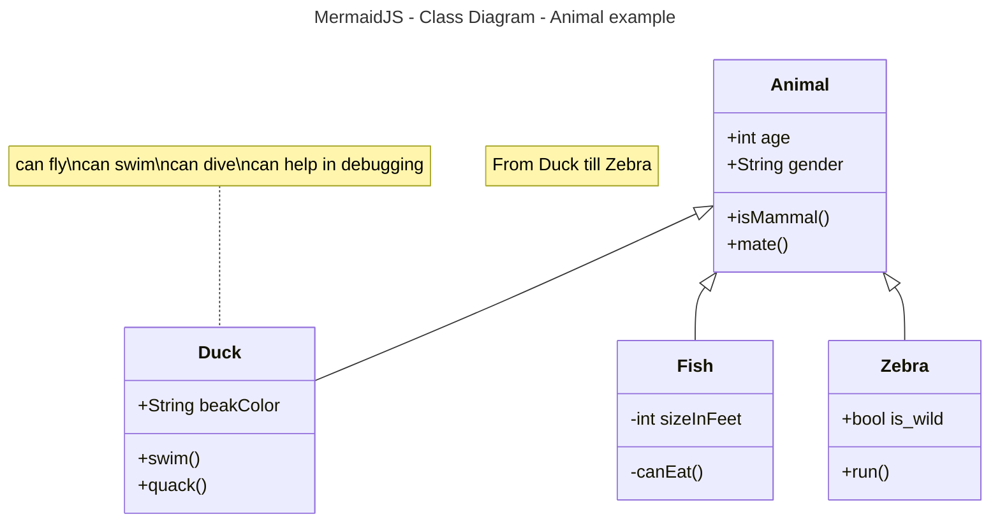

# Activity 1

- This is **activity 1** ...

## Fruit List
1. Pears
2. Apples
     1. Red
     2. Yellow
     3. Green
3. Oranges


## Links / Images

- [wikiBob](https://gitlab.com/bobby.estey/wikibob/-/blob/master/README.md)
- [Grand Canyon University](https://www.gcu.edu/)


---
## Tables
|First Name|Last Name|
|--|--|
|Chris|Peterson|
|Row2Column1|Row2Column2|
|USS Constellation<br>CVA/CV64<br>America's Flagship|||

---

```java
// Java Example
public class CodeBlock {
    public static void main(String[] args) {
        System.out.println("Code Block Example");
    }
}
```

## Details - Code Block - MermaidJS - Class Diagram

<details>



</details>