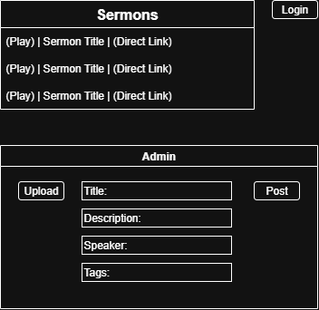
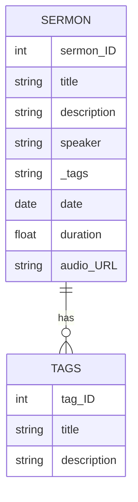
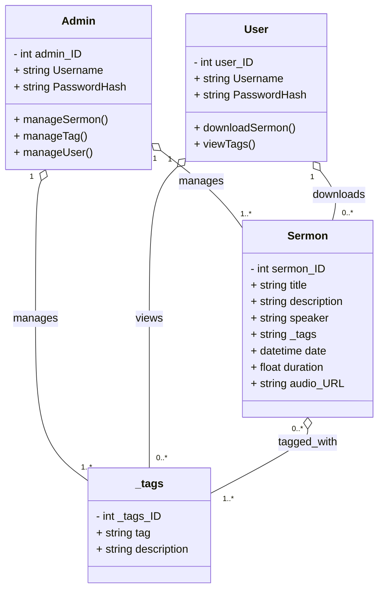
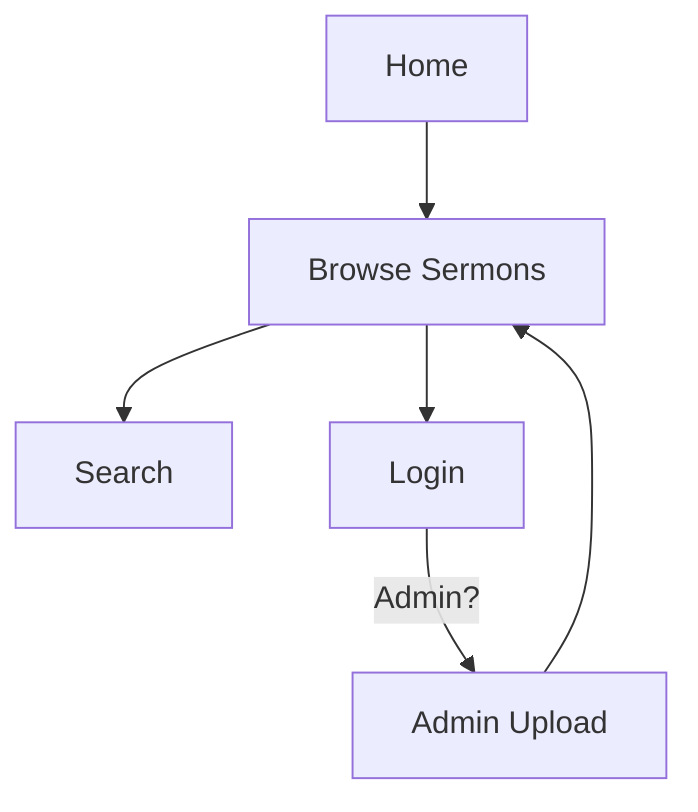
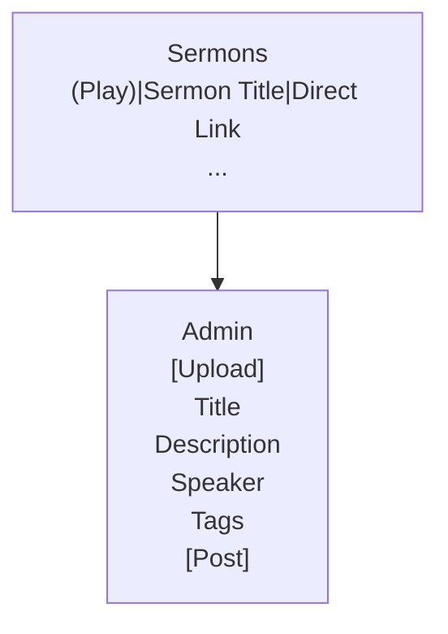

# Milestone 2

- Author:  Chris Peterson
- Date:  March 19, 2026

## Introduction

- The idea for my milestone project is a database of sermons, tagged and organized for download. The sermons would be uploaded at the admin side while the general user can pick and download whatever they want.

## Requirements

- As a visitor, I want to browse sermons by category so that I can find topics that interest me.
- As a user, I want to search sermons by keyword, speaker, or scripture reference so that I can quickly locate relevant content.
- As a user, I want to filter sermons by date, length, or topic so that I can narrow down my choices.
- As a user, I want to download sermons from the website and listen to them offline, or stream them straight from the site.
- As an Admin, I want do upload sermons to the database and add tags that the user finds useful, such as the date, length, and topic.

## Images
### Sitemap

- Below is the Sitemap


### Wireframes

- Below is the Wireframe for the basic portal of the site



### Database Design

- The following diagram is the Entity Relationship Diagram (ERD) showing how the databse interacts internally


### Class Diagrams

- The following diagrams are the Class diagrams showing how the site's databse interacts with the frontend


## Mermaid Diagrams

### Entity-Relationship Diagram



### Class Diagram



### Sitemap Flow



### Wireframe Layout




## REST Endpoints

- The Endpoints used in this will pull the tracks from the database and manipulate them when needed.

|Method|Endpoint|Description|
|--|--|--|
|GET|sermons|Retrieve a list of all sermons ...|
|GET|sermons/:id|Retrieve sermon ...|
|PUT|sermons/:id|Update sermon ...|
|DELETE|sermons/:id|Delete sermon ...|

## API Example API Requests

```json
  GET /sermons
  Response:
  [
    {
      "id": 01,
      "title": "Getting Started Right",
      "description": "",
      "speaker": "Richard Jordan",
      "date": "2021-05-02",
      "duration": "71.51",
      "audio_URL": "https://messages.shorewoodbiblechurch.org/WEBMedia/H/2021-05-02T12-13-04_2447904379.MP3"
    },
    {
      "id": 02,
      "title": "Why It Matters",
      "description": "",
      "speaker": "Richard Jordan",
      "date": "2021-05-09",
      "duration": "78.42",
      "audio_URL": "https://messages.shorewoodbiblechurch.org/WEBMedia/H/2021-05-09T12-14-20_2080650645.MP3"
    }
  ]
```

## Conclusion

- This is going to be a good way to learn how JavaScript and NodeJs work out. This milestone is also allowing me to lay out what I plan on working on soon.
