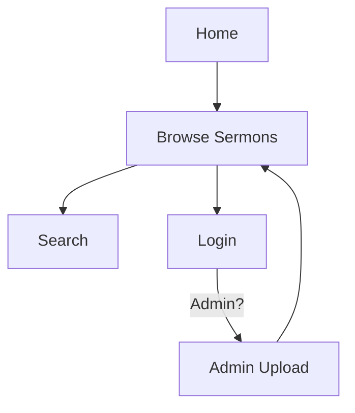
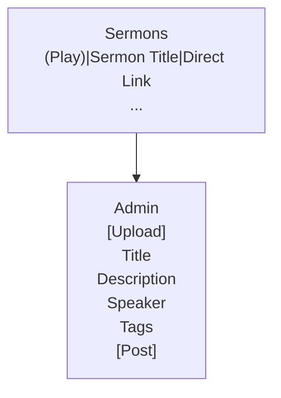
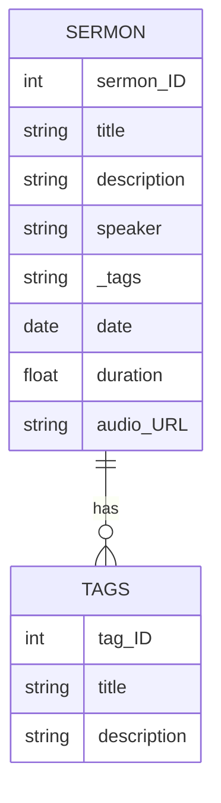
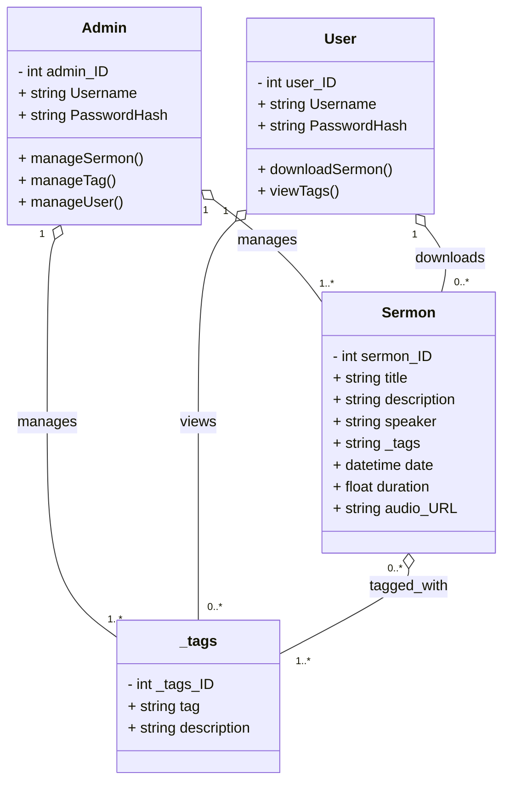

# Milestone 3

- Author: Chris Peterson
- Date: March 22, 2026

## Introduction

- This milestone implements a RESTful API for managing a sermons database, built using Node.js, Express, and TypeScript. The application allows users to browse, search, filter, and manage sermon content, including capabilities for downloading or streaming sermons. Admins can upload new sermons, add tags, and perform CRUD operations on the database. The API provides endpoints for retrieving sermons by various criteria such as speaker, title, tags, and date range, ensuring a comprehensive solution for sermon management.

## Requirements

- As a visitor, I want to browse sermons by category so that I can find topics that interest me.
- As a user, I want to search sermons by keyword, speaker, or scripture reference so that I can quickly locate relevant content.
- As a user, I want to filter sermons by date, length, or topic so that I can narrow down my choices.
- As a user, I want to download sermons from the website and listen to them offline, or stream them straight from the site.
- As an Admin, I want to upload sermons to the database and add tags that the user finds useful, such as the date, length, and topic.

## Images
### Sitemap

- Below is the Sitemap



### Wireframes

- Below is the Wireframe for the basic portal of the site




### Database Design

- The following diagram is the Entity Relationship Diagram (ERD) showing how the database interacts internally



### Class Diagrams

- The following diagrams are the Class diagrams showing how the site's database interacts with the frontend



## REST Endpoints

- The Endpoints used in this API pull sermons from the database and manipulate them when needed.

|Method|Endpoint|Description|
|--|--|--|
|GET|/sermons|Get all sermons (or specific sermon by ?sermonId=id)|
|GET|/sermons/speaker/:speaker|Get sermons by speaker name|
|GET|/sermons/search/speaker/:search|Search sermons by speaker (wildcard)|
|GET|/sermons/search/title/:search|Search sermons by title (wildcard)|
|GET|/sermons/search/tag/:search|Search sermons by tags (wildcard)|
|GET|/sermons/search/date/:startDate/:endDate|Get sermons within date range|
|POST|/sermons|Create a new sermon|
|PUT|/sermons|Update a sermon|
|DELETE|/sermons/:sermonId|Delete a sermon|
|GET|/tags|Get all tags (or specific tag by ?tagId=id)|
|POST|/tags|Create a new tag|
|PUT|/tags|Update a tag|
|DELETE|/tags/:tagId|Delete a tag|

## API Example API Requests

```json
  GET /sermons
  Response:
  [
    {
      "sermonId": 1,
      "title": "Getting Started Right",
      "description": "A sermon about starting your faith journey",
      "speaker": "Richard Jordan",
      "tags": "faith,beginning,growth",
      "date": "2021-05-02",
      "duration": 71.51,
      "audioUrl": "https://example.com/sermon1.mp3"
    },
    {
      "sermonId": 2,
      "title": "Why It Matters",
      "description": "Understanding the importance of faith",
      "speaker": "Richard Jordan",
      "tags": "faith,importance",
      "date": "2021-05-09",
      "duration": 78.42,
      "audioUrl": "https://example.com/sermon2.mp3"
    }
  ]
```

### Search Sermons by Speaker
```
GET /sermons/search/speaker/richard

Response:
[
  {
    "sermonId": 1,
    "title": "Getting Started Right",
    "speaker": "Richard Jordan",
    ...
  }
]
```

### Create a Sermon
```
POST /sermons
Content-Type: application/json

{
  "title": "New Sermon Title",
  "description": "Sermon description",
  "speaker": "Speaker Name",
  "tags": "tag1,tag2,tag3",
  "date": "2023-03-15",
  "duration": 45.30,
  "audioUrl": "https://example.com/sermon.mp3"
}

Response:
{
  "fieldCount": 0,
  "affectedRows": 1,
  "insertId": 3,
  "serverStatus": 2,
  "warningCount": 0,
  "message": "",
  "protocol41": true,
  "changedRows": 0
}
```

### Update a Sermon
```
PUT /sermons
Content-Type: application/json

{
  "sermonId": 1,
  "title": "Updated Title",
  "description": "Updated description",
  "speaker": "Speaker Name",
  "tags": "tag1,tag2",
  "date": "2023-03-15",
  "duration": 50.00,
  "audioUrl": "https://example.com/updated.mp3"
}
```

### Delete a Sermon
```
DELETE /sermons/1

Response:
{
  "fieldCount": 0,
  "affectedRows": 1,
  "insertId": 0,
  "serverStatus": 2,
  "warningCount": 0,
  "message": "",
  "protocol41": true,
  "changedRows": 0
}
```

## Conclusion

- Through this milestone, I learned how to build a RESTful API using Node.js, Express, and TypeScript. I gained experience in database integration with MySQL, implementing CRUD operations, and securing the API with middleware like Helmet and CORS. The project taught me about structuring a scalable API, handling different HTTP methods, parameterizing SQL queries to prevent injection, and documenting endpoints effectively. Additionally, I improved my skills in project organization, dependency management with npm, and running applications in development and production modes.